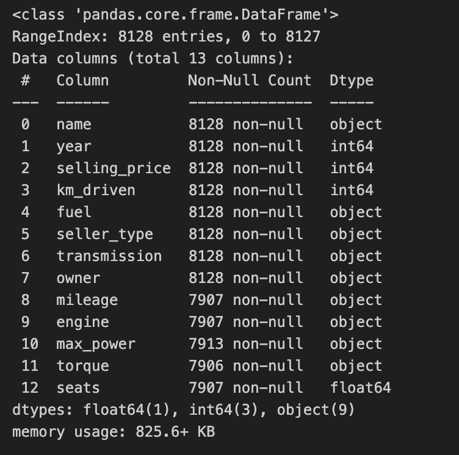
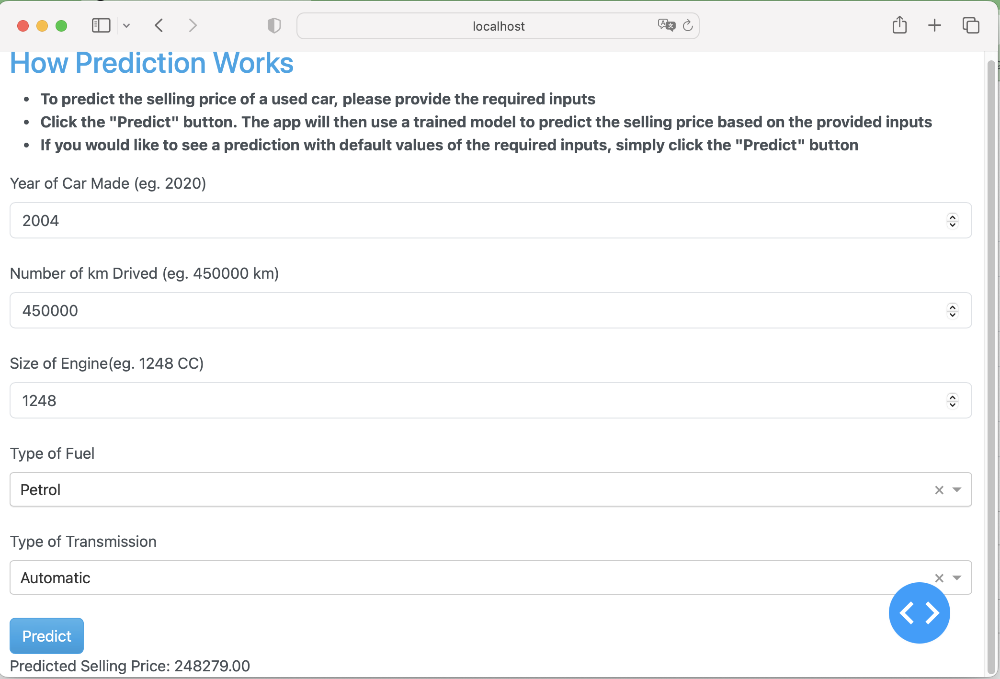

# Selling Price Prediction for cars

- [Selling Price Prediction of cars](#price-prediction-of-cars)

 
  - [Overview](#overview)
    - [Dataset Descrption](#dataset-descrption)
  - [Key technical aspects](#key-technical-aspects)
  - [Best Model selection](#best-model-selection)
    - [Metric](#metric)
    - [Best parametes](#best-parametes)
    - [Evaluation](#evaluation) 
    - [Feature importances](#feature-importances)
   - [Environment Setup](#environment-setup)


## Overview


In this assignment, We need to predict the **selling price for a car** . Finally, we also need to prepare a simple web-based car selling price prediction system for deployment.

### Dataset Descrption


The provide raw data contais following features- 

- **name** : Brand name of the Car
- **Year** : Year of the car made
- **selling_price**: Selling price of the car
- **km_driven**: How many Killometers A car already run
- **fuel**: Type of fuel is used in car
- **seller_type**: Type of seller (Invididual, Dealer etc)
- **transmission**: Type of transmission of car ( Manual, Automatic)
- **owner**: How many owner already did purchase of a car
- **mileage**: Mileage of the car
- **engine**: Engine size
- **max_power**: The max power is available to a car
- **torque**:if an engine has a lot of torque, the car can accelerate more quickly.
- **seats**: Number of seats are availabe to a car

This raw dataset is required to be processed on a set of given requirements. 

After fulfilling all the dataset processing requirements, the final data distribution is looked like the following figures-

After processing the final data distribution is looked like the following figures-

**The Raw Dataset**




The  Dataset after fulfilling all the processing requirements 


**Categorical data distribution**


**Numerical data distribution**


##  key technical aspects 

After thorough data exploration and visualization, several data preprocessing steps are chosen to prepare the dataset for modeling. Here are some notable aspects of the process:

- The feature ```name``` is renamed to ```brand```, and since there are 32 unique car brands in the dataset, we drop the ```brand``` feature due to the high number of categories compared to the dataset size.


- The target variable ```selling_price``` is Log transformed to make their distribution symetrical.

- Categorical variables like ```fuel_Type```, ```transmission```, and ```seller_type``` are ```one-hot encoded``` to convert them into numerical format suitable for machine learning algorithms.

- The ```year``` column is used to calculate the ```age``` of each car by subtracting the current year from the maximum year in the dataset, effectively introducing an 'aging effect'. The new feature ```age``` is then added to the dataset. And we drop the ```year``` column from the dataset.

- Based on exploratory data analysis (EDA) insights, domain knowledge, and correlation analysis, the following features are selected for modeling
[```km_driven```,```age```,``engine``,```fuel_Petrol```,```transmission_Manual```]
- The dataset is split into training and testing sets using the  ```train_test_split``` function from the ```sklearn.model_selection``` module

-  To ensure consistent scaling, the numerical features in both the training and testing sets are standardized using the ```StandardScaler``` from ```sklearn.preprocessing ```module. Standardization helps models perform better by ensuring that features are on a similar scale.

These technical aspects represent the key steps taken to preprocess the data and prepare it for various regression algorithms. The steps are chosen based on data characteristics, domain knowledge, and best practices to ensure optimal model performance.

The Correlation Matrix of the features- 


- **Train & Test Data distribution**
  - Total Dataset Size 8028
  - Training Dataset Size 5619 (``70%``)
  - Test Dataset Size 2409 (``30%``)


## Best Model selection

The data is trained on Linear Regression, SVM, KNeighbors Regressor, Decision-Tree Regressor, Random-Forest Regressor with hyper-parmeter tuning(using grid search). Random-Forest Regressor turn out be best model with lowest loss of 0.072.

### Metric 

* **Mean Squared Error** (MSE) is used as metric.
* MSE measures the average squared difference between the predicted and actual values. It gives us an idea of how close the predicted values are to the actual values. Lower MSE indicates better model performance.


### Best parametes

``` {'bootstrap': True, 'max_depth': 10, 'n_estimators': 84}```

These hyperparameters are determined using grid search with cross-validation, and they represent the configuration that yielded the best performance for the RandomForest Regressor model on our dataset.


### Evaluation

- **The training accuracy of Mean Squared Error (MSE) is 0.072, while the test accuracy is approximately 0.070.** 

It seems like the model is performing consistently well on both the training and test datasets, which indicates that the model is not overfitting to the training data. This suggests that the model's performance on new, unseen data is also good, making it a reliable predictor for the selling prices of cars based on the selected features.

### Feature importances

- Age : The "age" of the car is the most influential feature in predicting the selling price. This suggests that older cars tended to have lower selling prices.

- Engine : The "engine" feature also holds significant importance. Cars with higher engine specifications are associated with higher selling prices.

- Transmission Type : The "transmission_Manual" feature has a moderate influence. This indicates that manual transmissions may impact the selling price, although to a lesser extent compared to other features.

- Kilometers Driven : The "km_driven" feature has a relatively low importance. While it still contributes to the model's predictions, its impact is less significant compared to other features.

- Fuel Type : The "fuel_Petrol" feature has the lowest importance among the features. This suggests that fuel type might have a minimal impact on the selling price prediction.


### Environment Setup


To set up the environment for running the car selling price prediction Assignment, follow these steps:
 1. Install Python: Ensure  Python version 3.8.17 or above
 2. Install Required Packages
 ```pip install numpy==1.24.3
    pip install pandas==1.5.3
    pip install seaborn==0.12.2
    pip install matplotlib==3.7.2
    pip install scikit-learn==1.2.2
    pip install dash
    pip install dash_bootstrap_components
```

### Dash App Deployment 

All the files reqiured for setting up Dash deployment are in ```app/code``` folder. To deploy app locally, Please clone the git repo to local system and execute the following commands in your terminal setting project folder as working directory.

 ```
 python main.py
 ```

 Then, access the Dash Application: Once the script is running, open a web browser and visit **http://localhost:8050/**  to access the car selling price prediction web application.


 


 ### Docker Compose to run the app in a Docker container
Need to open terminal or command prompt and navigate to ```app`` directory where the docker-compose.yml and Dockerfile are located.

``````sh
docker compose up --build

```````

```````
Access the app with http://localhost:9001
```````
